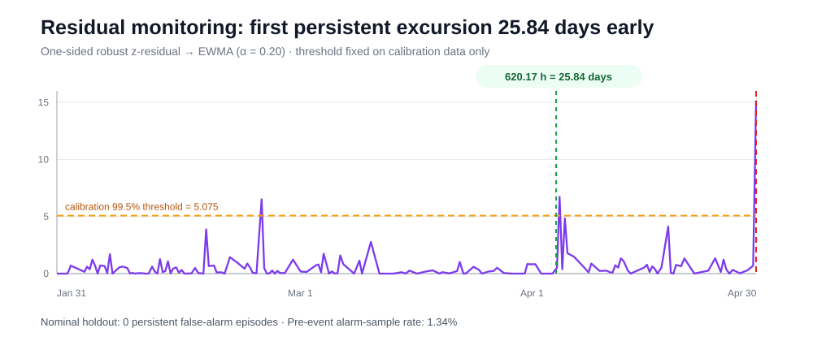
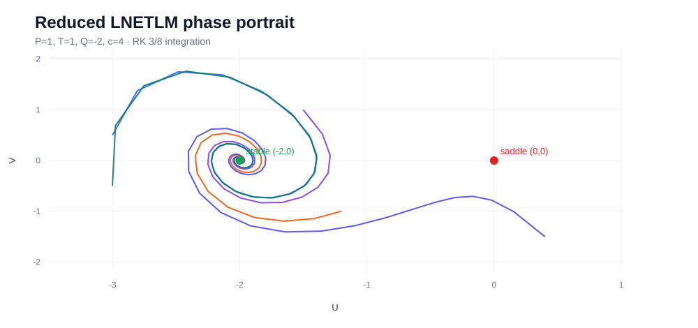

# Liting Zhang — Research Portfolio

Master's student in Electronic Information at Shanghai Dianji University  
Research interests: **Scientific Machine Learning · Predictive Maintenance · Nonlinear Dynamics · Industrial AI**

This repository collects selected research code, reproducible case studies and technical notes from my work on data-driven engineering systems.

## Featured research — Wind Turbine PHM

**Operating-condition-aware normal-behaviour modelling for SCADA condition monitoring**

The project asks a practical question: when temperature changes because wind speed, load and rotational speed also change, how can genuine abnormal behaviour be separated from normal operating variation?

| Primary T07 result | Value |
|---|---:|
| Chronological holdout R² | **0.903** |
| Holdout MAE | **1.41 °C** |
| First persistent residual excursion | **25.84 days before the logged event** |
| Nominal-holdout persistent false-alarm episodes | **0** |

[**Open the full project →**](projects/Wind-PHM-AI/)

The repository includes the real EDP-data analysis pipeline, chronological leakage controls, XGBoost NBM, residual/EWMA monitoring, stored metrics and a locked multi-event validation. Negative validation cases are retained rather than hidden.

## Research directions

### 1. Predictive Maintenance / PHM

Topics:
- operating-condition-aware monitoring
- normal-behaviour modelling
- residual-based anomaly detection
- time-series health indicators
- maintenance-event validation
- generalisation under changing load and environment

Project: [Wind-PHM-AI](projects/Wind-PHM-AI/)

### 2. Nonlinear Dynamics → Scientific Machine Learning

This project now contains a reproducible public implementation of the reduced nonlinear electrical-transmission-line dynamics used in my accepted *Pramana* work.

Implemented components include:
- reduced LNETLM equations and Jacobian;
- equilibrium and eigenvalue-based stability analysis;
- fourth-order Runge–Kutta **3/8** integration;
- phase-space and forcing-sensitivity diagnostics;
- finite-time trajectory-separation diagnostics;
- parameter-held-out trajectory datasets for later FNO / DeepONet / PINN comparisons.

[**Open the full project →**](projects/Fractional-Dynamics-AI/)

The SciML extension is designed around generalisation across dynamical regimes rather than random point-wise train/test splits.

### 3. Industrial Sensing / Embedded Monitoring

Hands-on engineering work connects sensor acquisition, embedded computing, physical modelling and real-time monitoring.

Examples include:
- Raspberry Pi based edge computing
- SPI / I2C sensor integration
- pressure / distance sensing
- physical interpretation of engineering measurements
- Flask-based HMI and live visualisation

Engineering note: [Industrial sensing and embedded monitoring](projects/Industrial-Sensing-Monitoring/)

## Publications

Selected accepted research outputs are listed in [publications/README.md](publications/README.md).

Current highlighted work includes:
- accepted journal research on fractional, bifurcation and dynamical behaviour in lossy electrical transmission-line models;
- an accepted MLIC 2026 conference paper in machine learning / intelligent computing.

## Technical stack

**Programming:** Python, MATLAB, C/C++, Java  
**Data / ML:** pandas, NumPy, scikit-learn, XGBoost, PyTorch, time-series analysis  
**Scientific ML:** PINNs, neural operators, data-driven dynamical modelling  
**Engineering:** SCADA, sensors, Raspberry Pi, SPI/I2C, Flask, data acquisition

## Repository principles

- public results should be traceable to code or stored metrics;
- time-series evaluation should respect chronology;
- successful and unsuccessful validation cases should both be visible;
- proprietary company code and restricted data are not uploaded;
- research prototypes should be described with their limitations, not only headline numbers.

## Contact

GitHub: https://github.com/litingg123add
