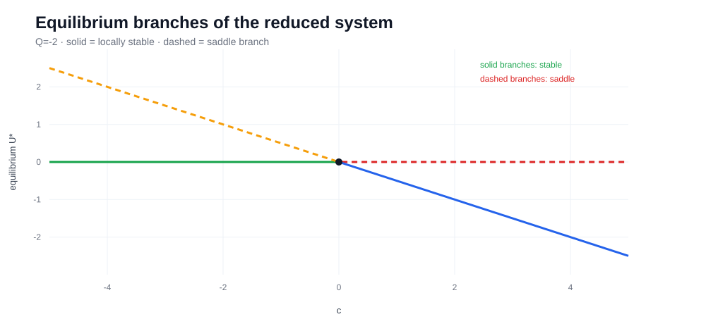
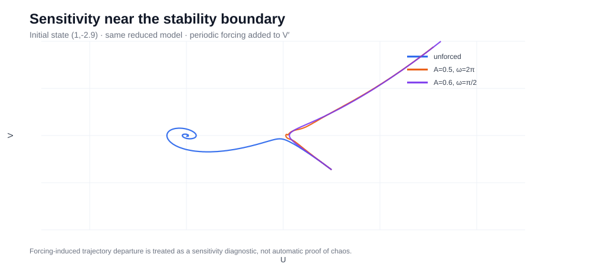

# Fractional Dynamics → Scientific Machine Learning


A public, reproducible subset of my research on **fractional nonlinear electrical transmission-line dynamics**, numerical verification and the transition from equation-based modelling to **Scientific Machine Learning**.

The associated first-author study has been accepted by *Pramana – Journal of Physics*. The public repository focuses on the parts that can be reproduced cleanly in code: the reduced dynamical system, equilibria, stability, phase-space trajectories, numerical integration, sensitivity diagnostics and trajectory-data generation for later SciML models.

## From PDE / fractional modelling to a dynamical system

After the travelling-wave reduction used in the research, the numerical dynamics are governed by

```text
P U'' + T U' + Q U² - cU = 0
```

or, with `V = U'`,

```text
U' = V
V' = -(T/P)V - (Q/P)U² + (c/P)U.
```

The code in `src/lnetlm.py` implements this system directly and computes local stability from the full Jacobian eigenvalues.

For `Q != 0`, the two unforced equilibria are

```text
(0, 0)    and    (c/Q, 0).
```

## Phase-space reproduction

For the reference parameter set

```text
P = 1, T = 1, Q = -2, c = 4
```

the equilibria are `(0,0)` and `(-2,0)`. Eigenvalue analysis identifies `(0,0)` as a saddle and `(-2,0)` as asymptotically stable.


The numerical trajectories above are integrated with the same **four-stage fourth-order Runge–Kutta 3/8 scheme** used in the numerical-verification section of the research.

## Bifurcation / equilibrium structure

The reduced system makes the equilibrium structure explicit: the second branch is `U*=c/Q`, so changing `c` moves one equilibrium through the origin and changes the local stability of the branches.



The public implementation deliberately uses eigenvalues of the Jacobian to classify stability rather than relying only on a scalar sign rule.

## Sensitivity and periodic forcing

The research also examined how perturbations and periodic forcing can change the long-term trajectory. The public code therefore supports

```text
V' = -(T/P)V - (Q/P)U² + (c/P)U + A sin(ωt).
```



The repository treats trajectory separation, finite-time Lyapunov estimates and stroboscopic sections as **diagnostics**. A single positive finite-time value is not used by itself as proof of chaos.

## Numerical method: RK 3/8

`src/rk38.py` implements

```text
y[n+1] = y[n] + h/8 (k1 + 3k2 + 3k3 + k4)
```

with stages at `0`, `1/3`, `2/3` and `1` of the time step.

The accepted study reported numerical errors at approximately the **10^-6** level for a representative analytical solution. This public project reproduces the numerical dynamical-system layer; it does **not** claim to reproduce every long symbolic mGREM solution family in code.

## What is implemented

### Core model
- reduced LNETLM right-hand side;
- analytical equilibrium locations;
- full Jacobian;
- eigenvalue-based local stability classification;
- optional periodic forcing.

### Numerical integration
- explicit RK 3/8 implementation;
- deterministic trajectory integration;
- divergence guard for unstable parameter / initial-condition cases.

### Dynamics diagnostics
- finite-time trajectory-separation Lyapunov estimate;
- stroboscopic section for periodically forced cases;
- two-trajectory sensitivity analysis.

### SciML bridge
`src/trajectory_dataset.py` generates supervised trajectory windows directly from the governing system. The default train/test split holds out **parameter values** rather than randomly mixing points from the same trajectory.

This supports a more meaningful future comparison of:
- FNO;
- DeepONet;
- PINN / fractional PINN;
- sequence baselines.

The intended evaluation is not only one-step error. I am interested in:
- short-horizon trajectory accuracy;
- error growth relative to a Lyapunov-time scale;
- stability near regime changes;
- preservation of phase-space geometry;
- generalisation to unseen parameter values.

## Quick start

```bash
python -m venv .venv
source .venv/bin/activate
pip install -r requirements.txt

python examples/reproduce_dynamics.py
python src/trajectory_dataset.py --output data/generated
pytest -q
```

## Repository structure

```text
Fractional-Dynamics-AI/
├── README.md
├── requirements.txt
├── assets/
│   ├── phase_portrait.svg
│   ├── equilibrium_branches.svg
│   └── forcing_sensitivity.svg
├── docs/
│   └── MODEL_NOTES.md
├── examples/
│   └── reproduce_dynamics.py
├── src/
│   ├── __init__.py
│   ├── lnetlm.py
│   ├── rk38.py
│   ├── diagnostics.py
│   └── trajectory_dataset.py
└── tests/
    └── test_core.py
```

## Connection to my research

The broader research combines:
- fractional-order formulations;
- modified Generalized Riccati Equation Mapping (mGREM);
- exact nonlinear-wave / soliton solutions;
- bifurcation and phase-space analysis;
- Lyapunov and Poincaré diagnostics;
- sensitivity analysis;
- numerical verification.

The current thesis direction extends the same nonlinear-system setting toward data-driven trajectory prediction and physics-guided learning.

For the equations and numerical notes behind the public implementation, see **[docs/MODEL_NOTES.md](docs/MODEL_NOTES.md)**.

For publication status, see **[../../publications/README.md](../../publications/README.md)**.
