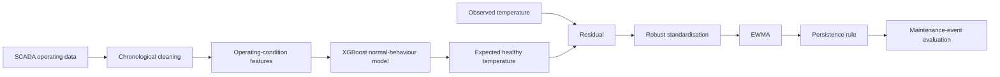
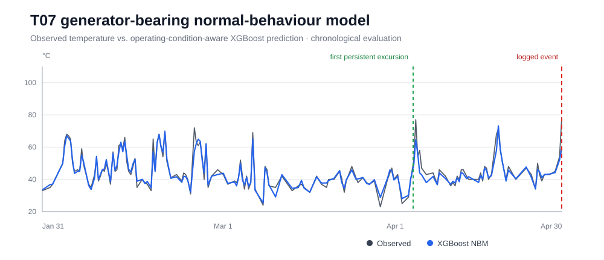
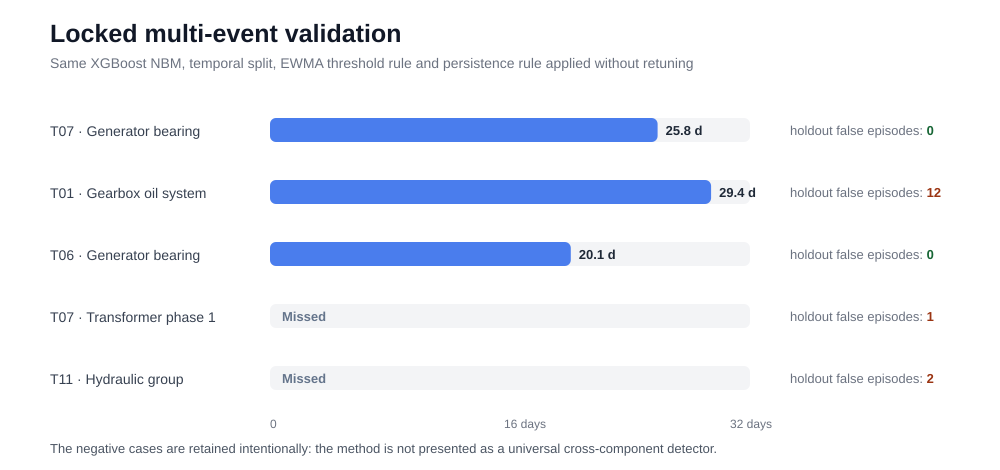

# Operating-Condition-Aware Wind-Turbine Condition Monitoring


A reproducible SCADA condition-monitoring study built around a simple engineering idea:

> **Estimate what a healthy turbine should look like under the current operating condition, then monitor the deviation from that expected behaviour.**

The primary case uses the public EDP wind-farm dataset and predicts the generator-bearing temperature of turbine **T07** with an operating-condition-aware normal-behaviour model (NBM).

## Headline result

| Item | Reproduced result |
|---|---|
| Turbine / target | T07 · `Gen_Bear_Temp_Avg` |
| Logged event | 2016-04-30 12:40 UTC — high generator-bearing temperature; sensor replaced |
| Normal-behaviour model | XGBoost with causal 1 h / 6 h operating summaries |
| Chronological holdout | **MAE 1.41 °C · RMSE 1.87 °C · R² 0.903** |
| Residual monitor | robust one-sided z-residual + EWMA (α = 0.20) |
| Alarm rule | calibration 99.5th-percentile EWMA threshold + persistence |
| First persistent excursion | **25.84 days (620.17 h) before the logged event** |
| Nominal holdout false alarms | **0 persistent episodes** |


The **25.84-day** value is the first intermittent persistent residual excursion. It is **not** presented as an alarm that stayed continuously active for 25.84 days, and it is not an RUL estimate.

## Why operating conditions matter

A fixed temperature threshold is not enough for turbine monitoring. The same component temperature can represent different states under different wind speeds, power levels, rotational speeds and ambient conditions.

The project therefore separates the problem into two stages:



Target-temperature lags are deliberately excluded so the model cannot simply track an abnormal temperature rise.

## Normal-behaviour fit



The evaluation is strictly time ordered:

| Window | Approx. period | Samples | Purpose |
|---|---|---:|---|
| Training | Jan 2016 | 2,212 | fit the NBM |
| Calibration | late Jan–Mar 1 | 3,183 | residual centre, scale and threshold |
| Nominal holdout | Mar 1–Mar 31 | 2,129 | accuracy and false-alarm evaluation |
| Pre-event monitoring | Mar 31–Apr 30 | 2,386 | lead-time evaluation only |

No monitoring sample is used for fitting or threshold selection.

## Locked multi-event validation

The original model logic and threshold-selection protocol were frozen and then applied to additional maintenance events.



The additional cases matter because they show the limits as well as the successful detections:

- **T06 generator bearing:** 20.05-day lead time, 0 nominal-holdout persistent episodes.
- **T01 gearbox oil system:** detected 29.41 days early, but with 12 nominal-holdout alarm episodes.
- **T07 transformer:** missed.
- **T11 hydraulic group:** missed.

The negative cases are intentionally retained. This is a research prototype, not a claim of universal cross-component fault detection.

## Reproduce the analysis

```bash
python -m venv .venv
source .venv/bin/activate
pip install -r requirements.txt

python src/prepare_data.py

python src/analysis.py \
  --case t07_generator_bearing \
  --data data/processed/signals_2016_selected.pkl.gz \
  --output results/final \
  --save-model --plots
```

To rerun the frozen multi-event protocol:

```bash
python src/locked_multi_event_validation.py
```

## Repository structure

```text
Wind-PHM-AI/
├── README.md
├── TECHNICAL_REPORT.md
├── assets/
│   ├── t07_residual_ewma.svg
│   ├── t07_temperature_prediction.svg
│   └── multi_event_validation.svg
├── data/
│   └── README.md
├── results/
│   ├── t07_generator_bearing/metrics.json
│   └── locked_multi_event_summary.csv
└── src/
    ├── prepare_data.py
    ├── analysis.py
    └── locked_multi_event_validation.py
```

## What is implemented in the code

**Data and leakage control**
- official EDP data preparation
- UTC timestamp ordering
- power-producing operating-regime filter
- strictly chronological train / calibration / holdout / monitoring windows
- trailing-only 1 h and 6 h summaries

**Normal-behaviour model**
- XGBoost regression
- Ridge baseline
- MAE / RMSE / R²
- split-conformal residual interval

**Residual monitoring**
- calibration median + MAD robust scaling
- one-sided residual score
- EWMA with gap reset
- calibration-only threshold selection
- 12-exceedances-in-3-hours persistence rule

**Event evaluation**
- first persistent excursion
- lead time
- nominal-holdout false-alarm episodes
- locked multi-event validation

## Interpretation and limitations

The EDP maintenance remark for the primary T07 case explicitly states **“High temperature in generator bearing (replaced sensor)”**. The result therefore supports early detection of abnormal thermal / sensor behaviour. It does **not** establish mechanical bearing damage for the full lead-time period.

The current study is retrospective and limited in event coverage. A stronger publication-grade extension would add broader cross-year validation, seasonal-drift analysis, uncertainty studies and more component-specific models.

For the exact experimental settings and interpretation, see **[TECHNICAL_REPORT.md](TECHNICAL_REPORT.md)**.

## Data source

Public EDP wind-turbine SCADA and maintenance data:

- EDP data portal: https://edp.com/en/innovation/data
- Dataset DOI: https://doi.org/10.17632/zjxjnjp3xs.1

Raw data are not duplicated in this repository. `src/prepare_data.py` prepares the official source files locally.
